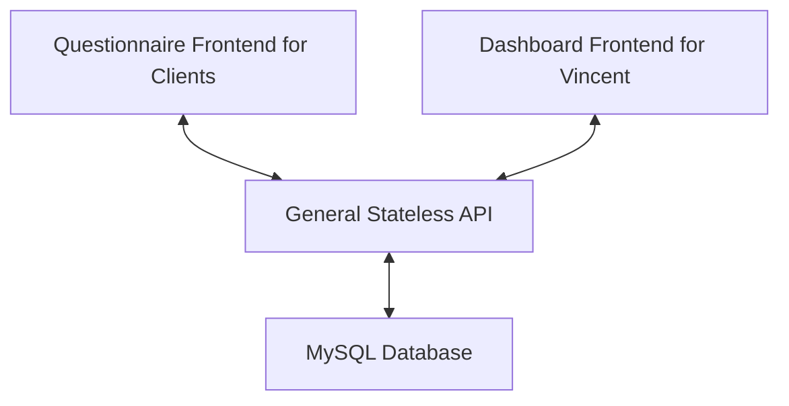

# HRMAS
`HRMAS` is the short term of `Human Resource Maturity Assessment System`, the project for IFN711.

This document is for the whole project. Document for a specific part is in the `README.md` file for the corresponding component.

## Project Structure
The project is consist of 4 parts:
- [client](./client/README.md): Questionnaire Frontend for Clients
- vincent: Dashboard Frontend for Vincent
- [api](./api/README.md): General Stateless API
- [db](./db/README.md): DB schema and initial SQL script of MySQL Database

Due to the size of our team, codes will be managed in [`Monorepo`](https://en.wikipedia.org/wiki/Monorepo) way, so this is the only repository for this project.

## How to Contribute
### If you are a developer
You should know:
1. Basic Git operations through on CLI or 3rd-party clients, including but not limited to:
    - how to commit code from local to remote (add, commit, push)
    - how to fetch the latest code from remote (pull, fetch)
    - how to checkout and merge branch (checkout, merge)
    - how to resolve conflict
2. Basic modern Front-end development skills (If you can finish `IFN666` independently, then you meet the requirement)
3. Code comment is very important in teamwork
4. Ensure your all commits/push to the `main` branch are executable
5. leave `TODO: things to optimize later` in code as reminder

### If you are a tester
You should know:
1. How to use `issue` functionality in GitHub following existing template
2. How to run the whole project locally or in container environment (if applicable)
